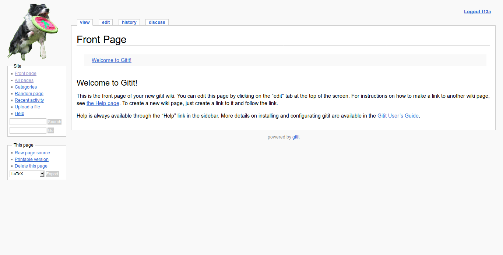
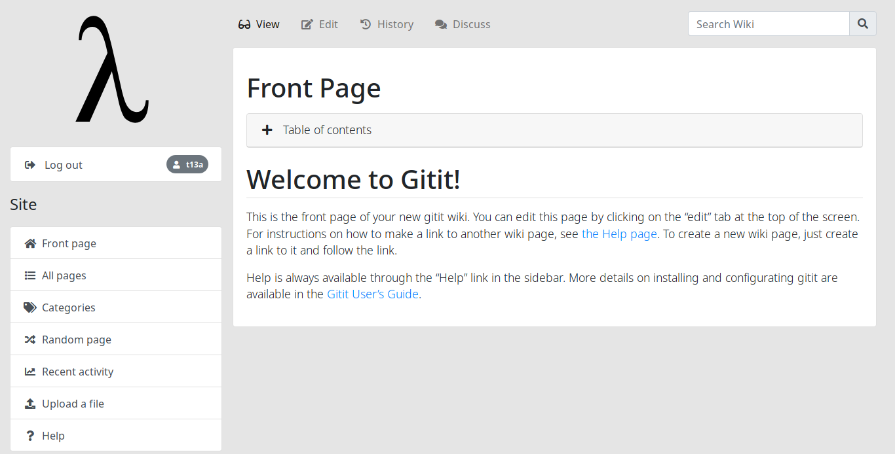
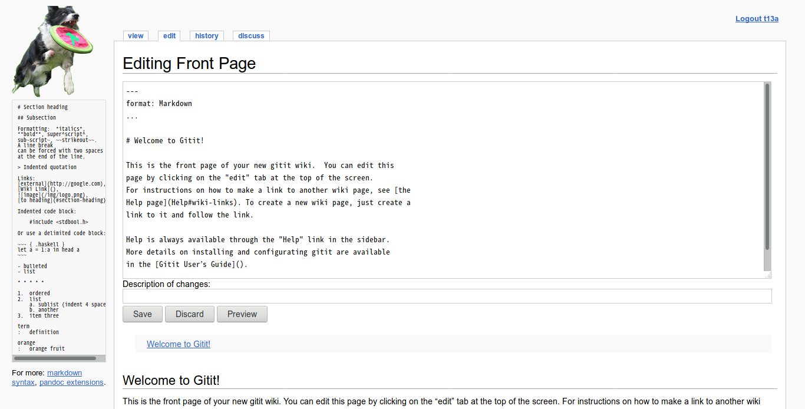
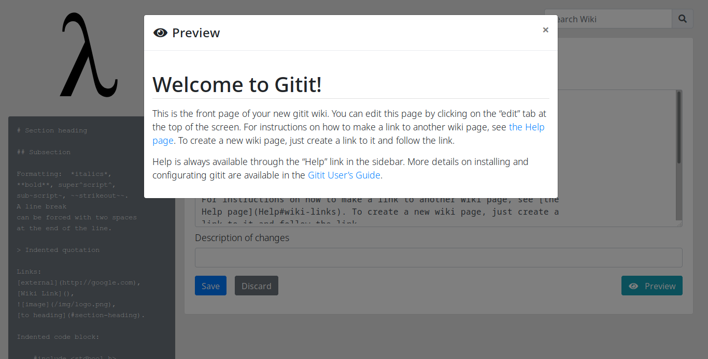
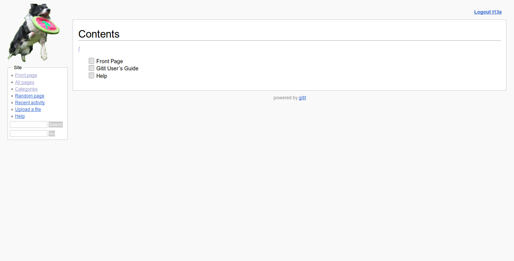
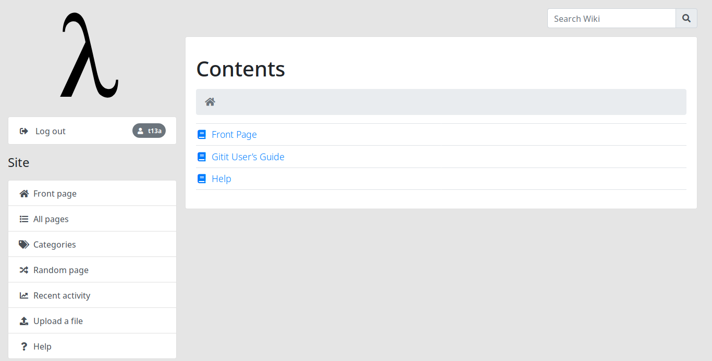
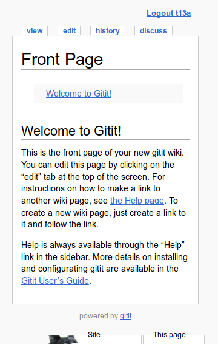
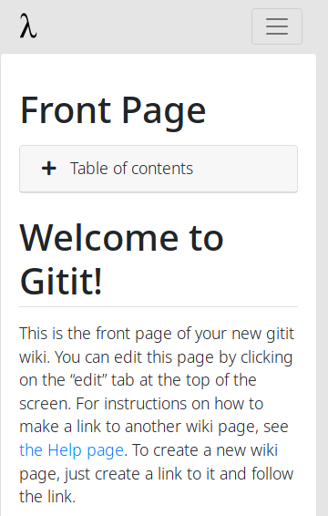
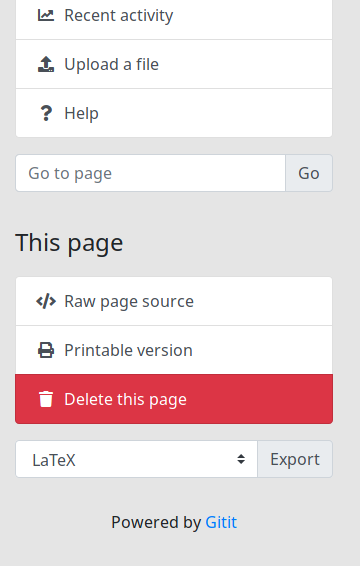

# Gitit Bootstrap Theme

Typical but sleek Bootstrap theme for [Gitit](https://github.com/gjm/gitit/).
Depends on following components.

-  JavaScript from [jQuery 3.3.1](https://jquery.com/).
-  JavaScript & Stylesheet from [Bootstrap 4.1.1](https://getbootstrap.com/).
-  Icons from [Fontawesome 5.1.0](https://fontawesome.com/).
-  Default logo from [Wiki Commons](https://commons.wikimedia.org/wiki/File:Lambda_lc.svg).

Some scripts or stylesheets are derived from the original one.

## Screenshots

| Feature | Original Theme | [Gitit Bootstrap Theme](https://github.com/t13a/gitit-bootstrap-theme) |
|---|:---:|:---:|
| Desktop Home |  |  |
| Edit Preview |  |  |
| Index |  |  |
| Mobile Home (Top) |  |  |
| Mobile Home (Bottom) |  |  |

## Install

    $ cd path/to/your-gitit-dir
    $ mv static{,.bak}
    $ mv templates{,.bak}
    $ git clone https://github.com/t13a/gitit-bootstrap-theme
    $ gitit-bootstrap-theme/src/build.sh
    ...
    $ cp -r gitit-bootstrap-theme/src/{static,templates} .

Then restart Gitit.

## Status

Currently in heavy development.

-  ~~View page~~
-  ~~View page (Printable version)~~
-  ~~View page (Revision)~~
-  View page (Diff)
-  ~~Edit page~~
-  ~~Preview page~~
-  ~~Delete page~~
-  History
-  Discuss
-  Register
-  ~~Login~~
-  Login failure
-  ~~Directory index~~
-  ~~Category index~~
-  Recent activity by all users
-  Recent activity by specific user
-  Upload a file
-  Search result by "Search Wiki"
-  Search result by "Go to page"
