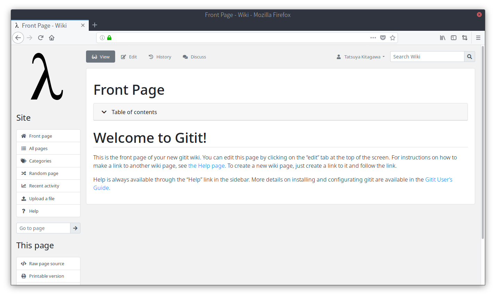
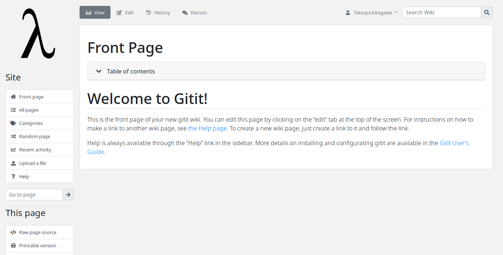
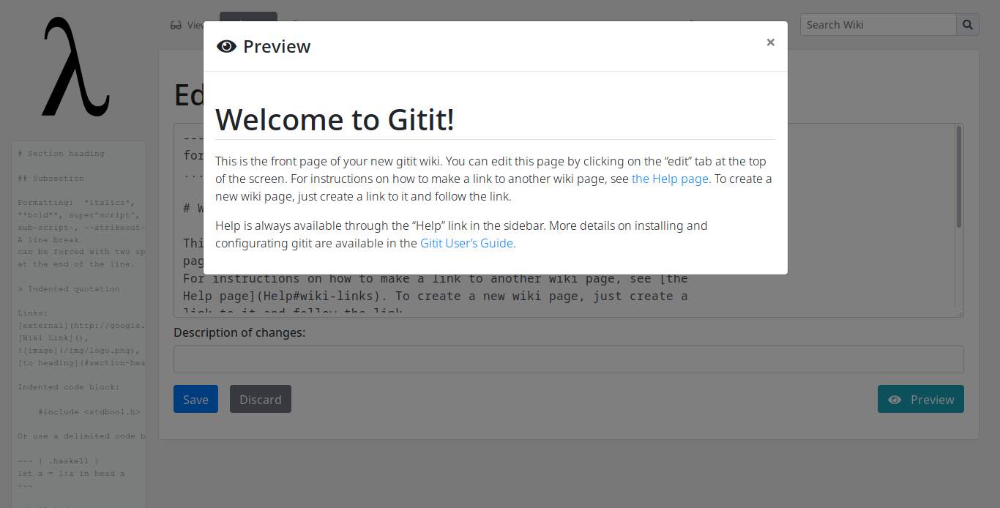
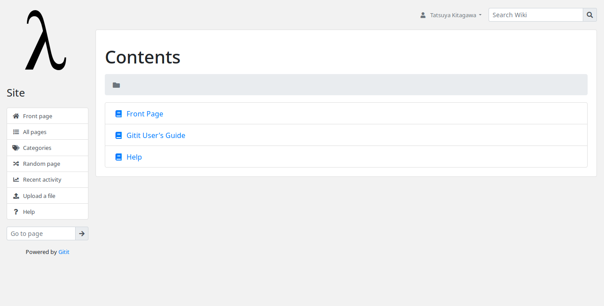
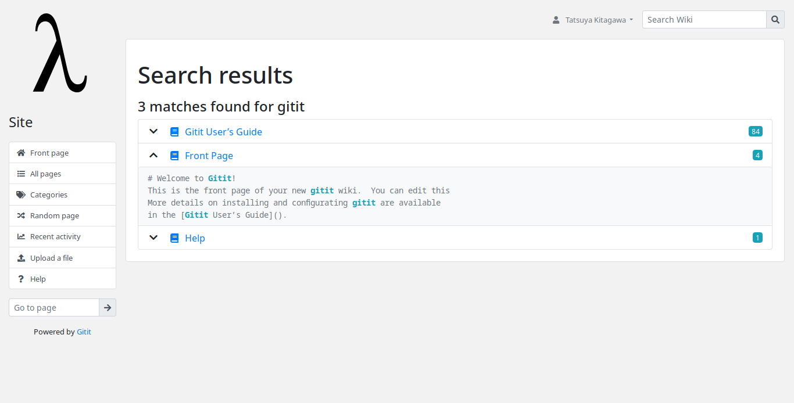
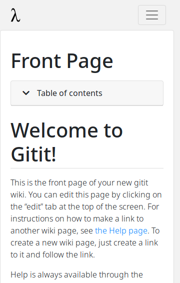
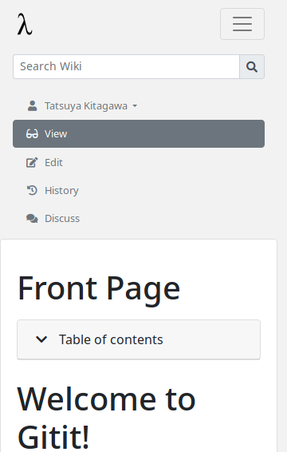

# Gitit Bootstrap Theme

Bootstrap theme for [Gitit](https://github.com/jgm/gitit/).  Using following components.

-  Scripts and stylesheets from [Gitit 1.12.2.1](https://github.com/jgm/gitit/), [Bootstrap 4.1.1](https://getbootstrap.com/), [jQuery 3.3.1](https://jquery.com/), [jQuery UI 1.12.1](https://jqueryui.com/).
-  Icons from [Fontawesome 5.1.0](https://fontawesome.com/).
-  Images from [Wiki Commons](https://commons.wikimedia.org/wiki/File:Lambda_lc.svg).

Some scripts or stylesheets are derived from the original one.

## Differences from original

This is just a theme not extension. But some features differ from original.

- Edit preview in modal dialog
- External link icon
- Foldable table of contents
- New default logo in SVG format

## Screenshots

## Install

    $ cd path/to/your-gitit-dir
    $ mv static{,.bak}
    $ mv templates{,.bak}
    $ git clone https://github.com/t13a/gitit-bootstrap-theme
    $ gitit-bootstrap-theme/build.sh
    ...
    $ cp -r gitit-bootstrap-theme/out/{static,templates} .

Then restart Gitit.
